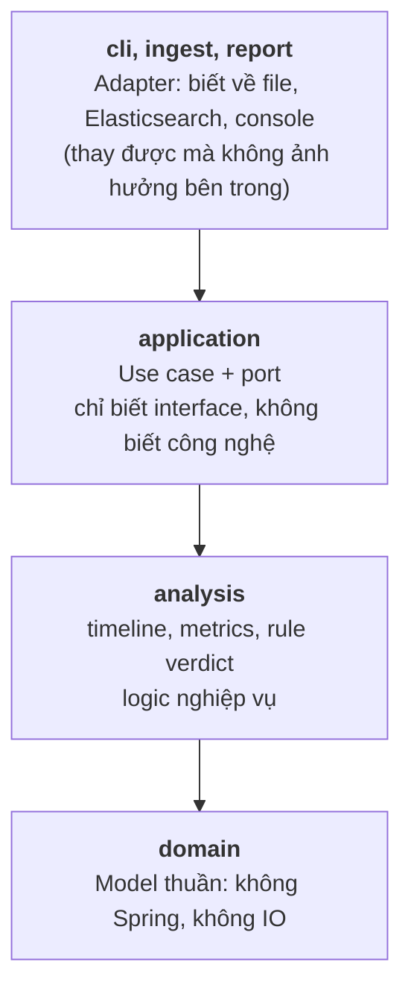

# Architecture Diagram v1 (Sprint 1)

Chuyển thể kiến trúc mục tiêu ở PROJECT_SPEC.md mục 3.1 thành những gì thực sự đã có sau
Sprint 1: một pipeline chạy CLI, chưa có AI, chưa có sanitizer, chưa có web UI. Tên package
dưới đây là tên thật trong `src/main/java/com/tutran/callassistant/`.

## Phân tầng

Code được chia thành 4 tầng, phụ thuộc **một chiều** từ ngoài vào trong. Đây là điều kiện
để tầng phân tích không bị dính vào công nghệ cụ thể, và để Sprint 2 đổi CLI thành Web UI
mà không phải sửa logic nghiệp vụ.

Muốn hiểu hệ thống làm gì, đọc đúng một class: `application/CallAnalysisPipeline` — tám
dòng, mỗi dòng là một thành phần trong kiến trúc mục tiêu, theo đúng thứ tự.

## Luồng dữ liệu

```mermaid
flowchart TD
    subgraph cli["cli — Entrypoint Sprint 1 (Web UI để dành Sprint 2)"]
        Dispatcher["CommandLineDispatcher<br/>(tra lệnh theo tên)"]
        Commands["ImportCommand / AnalyzeCommand / DemoCommand"]
        Presenter["ConsoleReportPresenter<br/>+ ConsoleWriter"]
        Dispatcher --> Commands
    end

    subgraph app["application — use case + port"]
        Pipeline["CallAnalysisPipeline<br/>(AnalyzeCallUseCase)"]
        ImportSvc["SignalingImportService<br/>(ImportSignalingUseCase)"]
        Resolver["SignalingSourceResolver<br/>(chọn nguồn signaling)"]
    end

    subgraph ingest["ingest — Data Loader + T1 + T3 Log Normalizer"]
        Detector["ContentBasedLogFileTypeDetector<br/>(hỏi từng parser, theo nội dung)"]
        EndCall["EndCallLogParser<br/>+ EndCallSchemaClassifier"]
        WebRtc["WebRtcLogParser<br/>(iOS + native)"]
        SigParser["SignalingExportParser"]
        DirSource["DirectoryClientLogSource<br/>(ClientLogSource)"]
        Fallback["FallbackSignalingSource<br/>(ES trước, file sau)"]
        EsSource["ElasticsearchSignalingSource"]
        FileSource["LocalFileSignalingSource"]
        Archive["ElasticsearchSignalingArchive<br/>(bulk import, idempotent)"]
        ESStore[(Elasticsearch<br/>local, Docker)]
        DirSource --> Detector
        Detector --> EndCall
        Detector --> WebRtc
        Detector --> SigParser
        FileSource --> SigParser
        Fallback --> EsSource
        Fallback --> FileSource
        EsSource -->|term query: callId| ESStore
        Archive -->|signaling.json| ESStore
    end

    subgraph domain["domain — T2 Canonical Event Model"]
        CanonicalEvent["CanonicalEvent<br/>(callId, leg, source, timestamp,<br/>timestampConfidence, attributes, rawLine)"]
    end

    subgraph analysis["analysis — T4 + T5 + T6 + T7"]
        Timeline["TimelineBuilder<br/>+ EventDeduplicator<br/>+ ClockSkewAnchor<br/>+ WebRtcElapsedTimeAnchor"]
        Metrics["CallMetricsCalculator<br/>(4 calculator chuyên trách)"]
        Rules["RuleVerdictEngine<br/>(chuỗi 7 VerdictRule)"]
        Quality["QualityInspector<br/>(3 QualityCheck)"]
        IceDetect["IceFailureDetector"]
        Rules --> IceDetect
        TurnDetect["TurnFailureDetector"]
        Rules --> TurnDetect
        Evidence["EvidenceEngine"]
        Taxonomy["IssueCategoryRegistry<br/>+ QualityThresholds"]
        Rules --> Quality
        Rules --> Evidence
        Quality --> Taxonomy
    end

    subgraph report["report — T8"]
        Assembler["RuleBasedReportAssembler<br/>+ MetricRowCatalog<br/>+ SuggestionCatalog"]
        Confidence["ConfidencePolicy"]
        Guard["ReportSchemaGuard<br/>(report-schema-v1.json)"]
        Renderer["TextReportRenderer<br/>(bố cục mục 4.5)"]
        Assembler --> Confidence
    end

    Commands --> Pipeline
    Commands --> ImportSvc
    ImportSvc --> Archive
    Pipeline --> Resolver
    Resolver --> Fallback
    Resolver --> FileSource
    Pipeline --> DirSource
    EndCall --> CanonicalEvent
    WebRtc --> CanonicalEvent
    SigParser --> CanonicalEvent
    EsSource --> CanonicalEvent
    CanonicalEvent --> Timeline
    Timeline --> Metrics
    Timeline --> Rules
    Metrics --> Rules
    Rules --> Assembler
    Metrics --> Assembler
    Assembler --> Guard
    Guard --> Pipeline
    Pipeline --> Presenter
    Presenter --> Renderer
    Renderer --> Stdout(["report ra stdout<br/>(Web UI: Sprint 2)"])

    classDef future fill:#eee,stroke:#999,color:#666,stroke-dasharray: 4 3
    Sanitizer["Input/Output Sanitizer<br/>(Sprint 2)"]
    AIEngine["AI Analysis Engine<br/>(Sprint 2)"]
    WebUI["Web UI<br/>(Sprint 2)"]
    class Sanitizer,AIEngine,WebUI future
    Metrics -.->|Sprint 2| Sanitizer -.-> AIEngine -.-> Assembler
    Stdout -.->|Sprint 2| WebUI
```

## Các đường biên đã chuẩn bị sẵn cho Sprint 2

Những chỗ Sprint 2 phải cắm thêm vào đều đã là interface, nên cắm vào là **thêm class**,
không phải sửa code đang chạy:

| Việc của Sprint 2 | Cắm vào đâu |
| --- | --- |
| AI Analysis Engine điền summary/analysis/suggestions | `report.ReportAssembler` (thêm một implementation, fallback về bản rule khi AI lỗi) |
| Guardrails đối chiếu verdict AI vs rule | `report.ReportGuard` (đã có `ReportSchemaGuard` trong pipeline) |
| Verdict cuối cùng do AI đề xuất | `analysis.verdict.VerdictEngine` (bọc `RuleVerdictEngine` lại, không thay thế) |
| Web UI thay CLI | `application.port.in.AnalyzeCallUseCase` + `port.out.ReportPresenter` |
| File upload thay vì đọc thư mục | `application.port.out.ClientLogSource` |
| Sanitizer trước khi gửi sang AI | giữa `metrics` và `assembler` trong `CallAnalysisPipeline` |

## Khác gì so với kiến trúc mục tiêu (mục 3.1)

- **Chưa có Chat API / Request Parser / File Validator** — Sprint 1 nhận trực tiếp đường
  dẫn thư mục cuộc gọi qua CLI thay vì tin nhắn chat kèm file đính kèm; chưa cần phân tích
  intent vì chưa có câu hỏi của người dùng.
- **Chưa có Input/Output Sanitizer hay AI Analysis Engine** — Sprint 1 chưa gửi gì sang AI
  provider (mục 3.2: "phần nào tính được bằng code thì không giao cho AI"), nên chưa cần
  ranh giới sanitizer. `docs/sensitive-data-inventory.md` là bước chuẩn bị cho Sprint 2.
- **Guardrails đã có phần khung** — `ReportSchemaGuard` nằm thật trong pipeline và kiểm tra
  mọi report theo JSON Schema; hai guard còn lại (evidence có thật, verdict AI vs rule) chỉ
  làm được khi đã có AI.
- **Report Renderer in ra stdout**, chưa có Web UI. Record `Report` và JSON Schema đã đúng
  là hợp đồng (contract) mà Web UI (Sprint 2 T1/T2) sẽ tiêu thụ — chỉ thay đổi phương tiện
  hiển thị, không thay đổi nội dung.
- **Có 2 đường lấy signaling data**: kiến trúc mục tiêu luôn query Elasticsearch; Sprint 1
  thêm `--from-file` (đọc trực tiếp `signaling.json`) để demo chạy được ngay cả khi chưa
  chạy `import`. Hai đường này là hai implementation của cùng một port
  `SignalingEventSource`, ghép lại bằng `FallbackSignalingSource`, nên pipeline không có
  nhánh `if/else` nào cho việc chọn nguồn.
