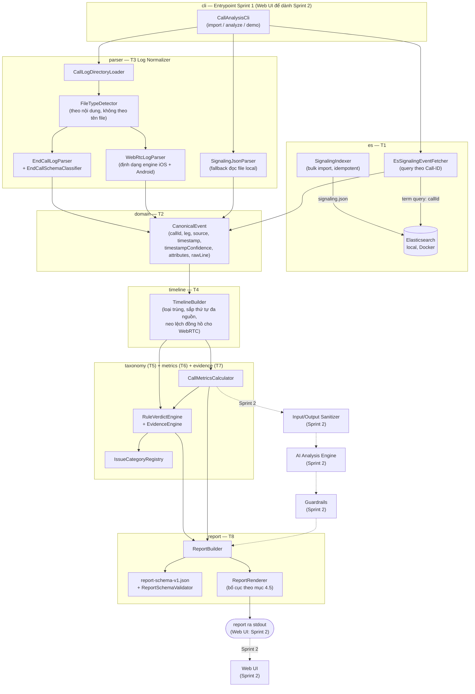

# Architecture Diagram v1 (Sprint 1)

Chuyển thể kiến trúc mục tiêu ở PROJECT_SPEC.md mục 3.1 thành những gì thực sự đã có sau
Sprint 1: một pipeline chạy CLI, chưa có AI, chưa có sanitizer, chưa có web UI. Tên package
dưới đây là tên thật trong `src/main/java/com/tutran/callassistant/`.

## Khác gì so với kiến trúc mục tiêu (mục 3.1)

- **Chưa có Chat API / Request Parser / File Validator** — Sprint 1 nhận trực tiếp đường
  dẫn thư mục cuộc gọi qua CLI thay vì tin nhắn chat kèm file đính kèm; chưa cần phân tích
  intent vì chưa có câu hỏi của người dùng.
- **Chưa có Input/Output Sanitizer, AI Analysis Engine, hay Guardrails** — Sprint 1 chưa
  gửi gì sang AI provider (mục 3.2: "phần nào tính được bằng code thì không giao cho AI"),
  nên chưa cần ranh giới sanitizer. `docs/sensitive-data-inventory.md` là bước chuẩn bị
  cho sanitizer của Sprint 2.
- **Report Renderer in ra stdout**, chưa có Web UI. POJO `Report` và JSON Schema đã đúng
  là hợp đồng (contract) mà Web UI (Sprint 2 T1/T2) sẽ tiêu thụ — chỉ thay đổi phương
  tiện hiển thị.
- **Có 2 đường lấy signaling data**: kiến trúc mục tiêu luôn query Elasticsearch; CLI
  Sprint 1 hỗ trợ thêm `--from-file` (đọc trực tiếp `signaling.json`) để demo chạy được
  ngay cả khi chưa/không chạy `import`, tiện cho việc debug nhanh với một cuộc gọi cụ thể.
