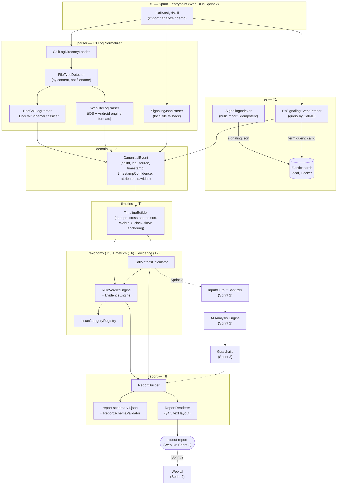

# Architecture Diagram v1 (Sprint 1)

Adapts PROJECT_SPEC.md §3.1's target architecture to what actually exists after
Sprint 1: a CLI pipeline with no AI, no sanitizer, and no web UI yet. Package names are
the real ones under `src/main/java/com/tutran/callassistant/`.

## What changed vs. the target architecture (§3.1)

- **No Chat API / Request Parser / File Validator yet** — Sprint 1 takes a call
  directory path directly on the CLI instead of a chat message with attachments; intent
  parsing has no reason to exist without a user question yet.
- **No Input/Output Sanitizer, AI Analysis Engine, or Guardrails** — nothing is sent to
  an AI provider in Sprint 1 (§3.2: "phần nào tính được bằng code thì không giao cho
  AI"), so there is no sanitizer boundary to sit at yet. `docs/sensitive-data-inventory.md`
  is the groundwork for Sprint 2's sanitizer.
- **Report Renderer prints to stdout**, not a Web UI. The `Report` POJO and JSON Schema
  are already the exact contract the Web UI (Sprint 2 T1/T2) will consume — only the
  transport changes.
- **Two paths into signaling data**: the target architecture always queries
  Elasticsearch; Sprint 1's CLI also supports `--from-file` (parsing `signaling.json`
  directly) so the demo works even before/without running `import`, useful for quick
  debugging against a specific sample call.
